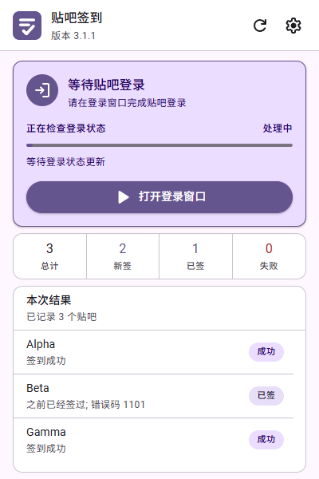
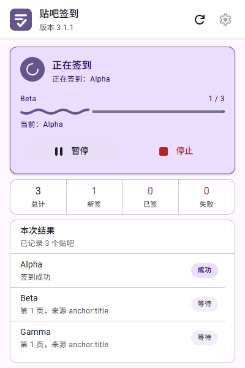
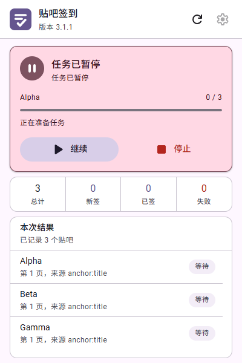
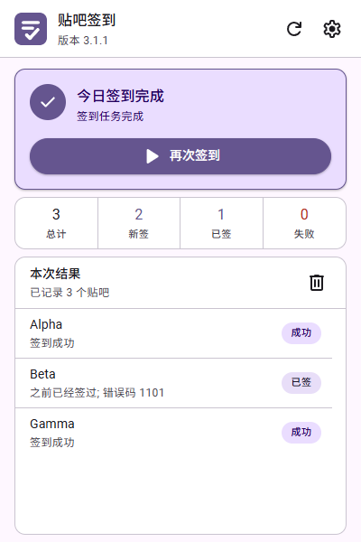
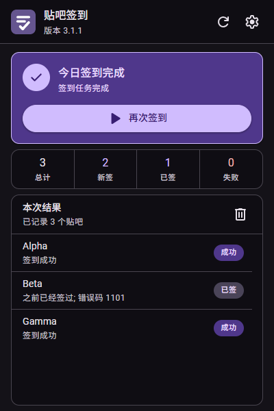

# TiebaAutoCheckinExtension

一个面向 Microsoft Edge 与其他 Chromium 浏览器的百度贴吧自动签到扩展。它使用浏览器当前的百度贴吧登录状态，扫描已关注贴吧，并在扩展弹窗中完成签到、进度展示和失败重试。

当前版本：`3.1.1`  
界面语言：简体中文  
扩展规范：Manifest V3

> 本项目是独立开发的非官方工具，与百度、百度贴吧或 Microsoft 没有隶属、赞助或官方合作关系。自动化操作可能受到目标网站规则、接口变化或账号风控限制；使用者应自行确认并遵守百度贴吧的服务条款，不得用于批量账号、滥用请求或其他违规用途。

## 功能

- 使用当前 Edge 中的百度贴吧登录cookie。
- 扫描当前账号已关注的贴吧并执行签到。
- 支持快速签到和“检查后签到”两种模式。
- 显示扫描、签到进度以及成功、已签到、失败结果。
- 支持暂停、继续、停止和仅重试失败项目。
- 对临时网络错误进行有限次数的退避重试。
- 可选每日自动签到时间和任务完成通知。
- 弹窗关闭后，任务可通过 Manifest V3 offscreen document 继续运行。
- 支持浅色、深色主题和减少动画偏好。

## 设计风格与第三方素材

本扩展的界面设计参考 Google 的开源设计系统 [Material Design 3（M3）](https://m3.material.io/)，并根据浏览器扩展 400 × 600 弹窗、键盘操作、深色主题和减少动画等场景，以原生 HTML、CSS 和 JavaScript 进行了适配实现。

界面中的部分操作图标采用或改编自 Google [Material Symbols / Material Icons](https://github.com/google/material-design-icons)。Google 官方以 [Apache License 2.0](https://www.apache.org/licenses/LICENSE-2.0) 提供这些图标。本项目对 Material Design 和 Material Symbols 的引用仅用于说明设计体系与素材来源，不表示 Google 对本项目提供认可、赞助或官方支持。

## 安装

### 从 GitHub 下载

1. 在仓库页面点击 **Code > Download ZIP**。
2. 解压下载的 ZIP。
3. 在 Microsoft Edge 地址栏打开 `edge://extensions`。
4. 打开页面左侧的**开发人员模式**。
5. 点击**加载解压缩的扩展**。
6. 选择解压后、直接包含 `manifest.json` 的目录。
7. 建议将“贴吧签到”固定到浏览器工具栏。

也可以克隆仓库后，直接在 `edge://extensions` 中加载仓库根目录：

```powershell
git clone https://github.com/SugarRainbow/TiebaAutoCheckinExtension.git
```

## 使用

1. 先在 Edge 中正常登录百度贴吧。
2. 点击工具栏中的“贴吧签到”图标。
3. 点击**开始签到**。
4. 如果当前登录状态无效，扩展会打开百度贴吧官方登录窗口；登录完成后再返回扩展。
5. 在主页面查看实时进度和每个贴吧的执行结果。
6. 如有失败项目，可使用**重试失败项**。

设置页面可以调整签到模式、扫描页数、请求间隔、网络重试、每日计划和通知。建议保留合理的请求间隔，不要设置为 `0` 或进行高频重复操作。

## 权限说明

| 权限                      | 用途                                |
| ----------------------- | --------------------------------- |
| `alarms`                | 在用户主动启用每日计划后，按指定时间启动签到。           |
| `cookies`               | 读取百度域名的必要登录 Cookie，并在本机保存或恢复登录状态。 |
| `notifications`         | 在用户启用通知后显示任务完成或失败提示。              |
| `offscreen`             | 弹窗关闭后继续执行较长的扫描和签到流程。              |
| `storage`               | 在本机保存设置、任务进度、最近结果和登录 Cookie 副本。   |
| `https://*.baidu.com/*` | 访问百度及百度贴吧官方 HTTPS 页面和签到接口。        |

扩展不申请浏览历史、下载、剪贴板、摄像头、麦克风、地理位置、代理、原生程序或所有网站访问权限。

## 隐私与安全

- 扩展只连接百度官方 HTTPS 域名，没有开发者后端、遥测、广告或第三方分析服务。
- 所有 JavaScript、HTML 和 CSS 都包含在仓库中，不加载或执行远程代码。
- 登录只在百度贴吧官方页面完成，扩展不提供或仿制登录表单。
- 扩展会将必要的百度认证 Cookie 副本保存到浏览器的扩展本地存储，并允许用户在设置页查看或清除该副本。
- 请勿在共享电脑上保存登录状态，也不要向任何人发送 Cookie、设置页明文截图或浏览器配置文件。
- 停止使用时，可先在设置页清除 Cookie 副本，再从 `edge://extensions` 卸载扩展。

此仓库不包含真实账号、Cookie、密码、API 密钥或其他凭据。`screenshots/` 中的贴吧名称均为自动化测试使用的合成数据。

## 截图

<table>
  <tr>
    <td align="center"><br>等待登录</td>
    <td align="center"><br>正在签到</td>
  </tr>
  <tr>
    <td align="center"><br>暂停与继续</td>
    <td align="center"><br>签到结果</td>
  </tr>
  <tr>
    <td align="center"><br>深色主题</td>
    <td></td>
  </tr>
</table>

## 项目结构

```text
TiebaAutoCheckinExtension/
├─ manifest.json
├─ background.js
├─ auth.js
├─ content.js
├─ core.js
├─ shared.js
├─ popup.html
├─ popup.css
├─ popup.js
├─ offscreen.html
├─ icons/
├─ screenshots/
└─ README.md
```

仓库内容可以直接加载，不需要构建步骤、Node.js 依赖或本地服务。

## 常见问题

### 扩展提示未登录

点击登录操作，在扩展打开的百度贴吧官方窗口完成登录，然后回到扩展检查状态。若仍然失败，可在设置页清除保存副本后重新登录。

### 每日任务没有运行

确认已启用“每日自动签到”、Edge 在计划时间附近处于运行状态，并允许浏览器通知。浏览器休眠或系统关机时，任务可能延后到浏览器恢复后执行。

### 部分贴吧签到失败

可能是网络波动、登录失效、百度限流、账号风控或接口变化。请先降低频率，不要连续重复请求；必要时稍后再试。

## 安全问题反馈

可以通过 GitHub Issues 报告可复现的问题，但请务必删除 Cookie、账号、请求头、浏览器配置路径和其他敏感信息。不要在公开 Issue 中粘贴认证凭据。

## 许可

除另有说明外，本项目以 [Apache License 2.0](LICENSE) 发布。该许可证允许使用、修改、分发和商业使用，要求保留许可证及相关版权声明，并为贡献内容提供明确的专利授权。

Google Material Symbols / Material Icons 仍遵循其原始 Apache-2.0 许可。第三方素材来源和商标声明见 [NOTICE](NOTICE)。
